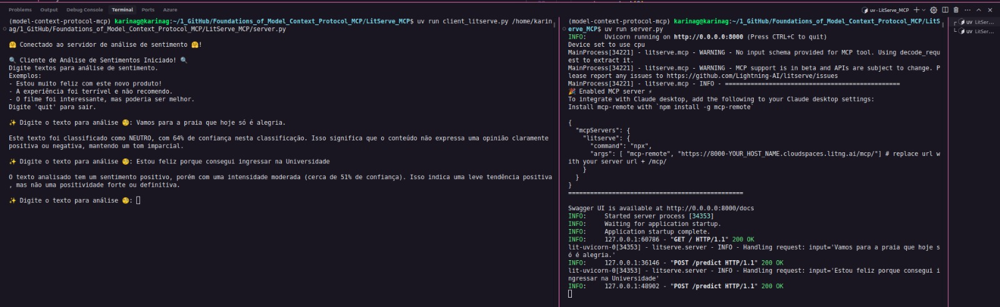

# <h1 align="center"><font color="gree">MCP with LitServe</font></h1>

<font color="pink">Senior Data Scientist.: Dr. Eddy Giusepe Chirinos Isidro</font>


## <font color="blue">LitServe MCP</font>

O `LitServe` integra o `MCP` por meio de um endpoint ddicado `/mcp/` que expõe qualquer subclasse do LitAPI como uma ferramenta compatível com o MCP. Ele utiliza a especificação oficial de fluxo HTTP do MCP e não requer alterações na lógica do modelo.

## <font color="blue">Benefícios</font>

* Conecte-se ao Claude ou Cursor sem código adicional
* Continue usando sua classe LitAPI existente
* Habilitar fluxos de trabalho de bate-papo estruturado, classificação ou assistência de código
* Segue a especificação HTTP oficial  do MCP

## <font color="blue">Usando LitServe MCP</font>



## <font color="blue">Instalando o Hugging Face</font>

No terminal, digite o comando:
```bash
huggingface-cli login
```

## <font color="blue">Alguns comandos úteis</font>

```bash
sudo lsof -i :8000
```

```bash
sudo kill -9 <PID>
```


Thank God!