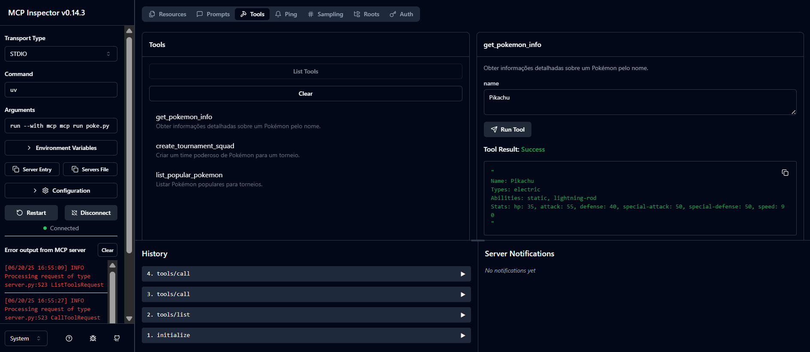
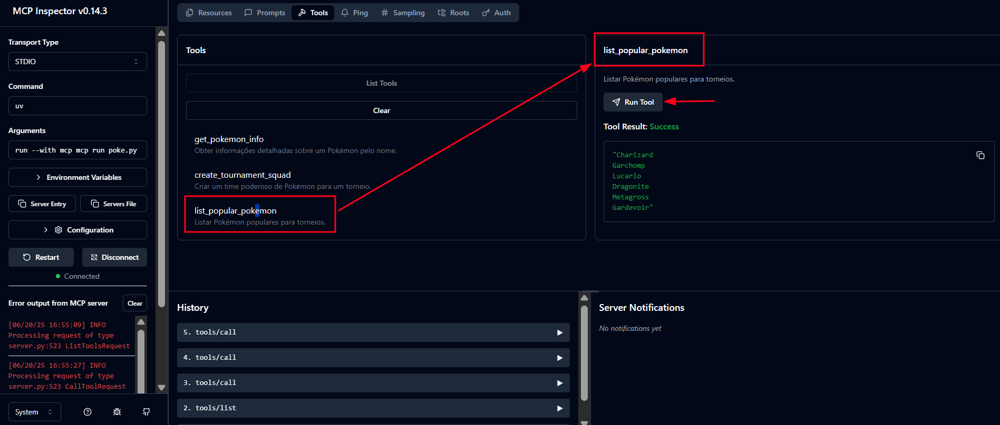

# <h1 align="center"><font color="gree">Pokemon MCP Server</font></h1>

<font color="pink">Senior Data Scientist.: Dr. Eddy Giusepe Chirinos Isidro</font>

Link de estudo: [mcp pokemon](https://www.youtube.com/watch?v=Fhy_VFMlE9s)


Este é um servidor MCP (Model Context Protocol) simples que se conecta à [PokéAPI](https://pokeapi.co/) e expõe ferramentas que um LLM pode usar para buscar dados de ``Pokémon``, listar Pokémon populares e montar um time de torneio.

Ele usa a biblioteca FastMCP para buscar informações sobre Pokémon por meio de um protocolo padronizado que funciona perfeitamente com ``LLMs`` e ``agentes de IA``.


## <font color="red">Instalação e Configuração</font>

Para executar este servidor Pokemon MCP, siga os passos abaixo:

### ``1.`` <font color="blue">Instalação do Node.js</font>

Remova versões anteriores ou pacotes conflitantes:
```bash
sudo apt purge nodejs npm libnode-dev libnode72
sudo apt autoremove
sudo apt clean
```

Adicione o repositório NodeSource para a versão 18:
```bash
curl -fsSL https://deb.nodesource.com/setup_18.x | sudo -E bash -
```

Instale o Node.js:
```bash
sudo apt install -y nodejs
```

Se encontrar erros de conflito de pacotes, use:
```bash
sudo dpkg -i --force-overwrite /var/cache/apt/archives/nodejs_*_amd64.deb
sudo apt --fix-broken install
```

Verifique a instalação:
```bash
node -v
npm -v
```

### ``2.`` <font color="blue">Instalação do MCP e httpx</font>

Instale o pacote ``MCP``:
```bash
uv add mcp[cli] httpx
```

### ``3.`` <font color="blue">Executando o Servidor em modo de desenvolvimento</font>

Para iniciar o servidor e a interface web:
```bash
mcp dev poke.py
```

## <font color="red">Testando o Servidor</font>

Você pode testar o servidor no modo de desenvolvimento, para isso, você deve seguir os passos abaixo:

```bash
cd Pokemon_MCP_Server

mcp dev poke.py
```
Logo após, você observará a seguinte interface:







Thank God!